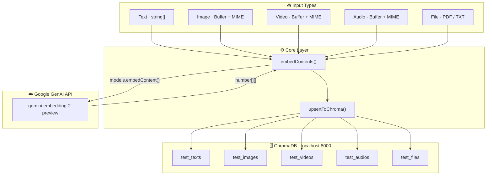
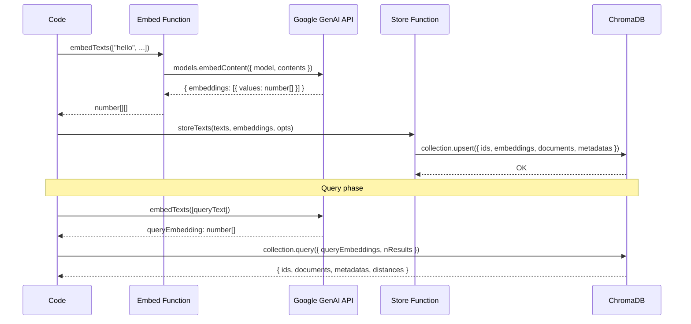

# 🧠 Multimodal Embedding & Vector Search

TypeScript code for generating multimodal embeddings (text, image, video, audio, and file) using the Google GenAI Gemini Embedding API and storing them in a ChromaDB vector database for semantic search and retrieval.

---

## ✨ Features

- **5 modality types** — embed and store text, images, videos, audios, and files (PDF / plain text)
- **Cross-modal retrieval** — query with text to find semantically similar images, videos, or audio clips
- **ChromaDB integration** — upsert and query embeddings with metadata filtering
- **Batch processing** — embed multiple items in a single call
- **Type-safe** — full TypeScript types for all MIME types and options

---

## 🏗️ Architecture



---

## 📋 Prerequisites

- **Node.js** v18+
- **TypeScript** v5+
- A valid **Google AI API key** with access to the Gemini Embedding model

---

## 🚀 Getting Started

### 1. Clone the repository

```bash
git clone https://github.com/codewitheren/google-embedding-2.git
cd google-embedding-2
```

### 2. Install dependencies

```bash
npm install
```

### 3. Set up environment variables

Create a `.env` file in the project root:

```env
GOOGLE_API_KEY=your_google_api_key_here
CHROMA_HOST=localhost
CHROMA_PORT=8000
```

### 4. Start ChromaDB

```bash
npx chroma run --path ./chroma
```

### 5. Prepare asset folders

Place your media files in the following directories before running tests:

```
public/
├── images/     # 1.png, 2.png, 3.png, 4.png, 5.png
├── videos/     # 1.mp4, 2.mp4, 3.mp4
├── audios/     # 1.wav
└── files/      # 1.txt, 2.txt
```

### 6. Run the test suite

```bash
npx ts-node index.ts
```

---

## 📖 API Reference

### Embedding Functions

All embed functions return `Promise<number[][]>` — a list of embedding vectors.

| Function | Input | Default MIME |
|---|---|---|
| `embedTexts(texts)` | `string[]` | — |
| `embedImages(buffers, mime?)` | `Buffer[]` | `image/jpeg` |
| `embedVideos(buffers, mime?)` | `Buffer[]` | `video/mp4` |
| `embedAudios(buffers, mime?)` | `Buffer[]` | `audio/mp3` |
| `embedFiles(buffers, mime?)` | `Buffer[]` | `application/pdf` |

**Supported MIME types:**

| Type | Values |
|---|---|
| Image | `image/jpeg` · `image/png` · `image/webp` · `image/gif` |
| Video | `video/mp4` · `video/webm` |
| Audio | `audio/mp3` · `audio/wav` · `audio/ogg` |
| File | `application/pdf` · `text/plain` |

---

### Store Functions

Store pre-computed embeddings into ChromaDB. All store functions accept a `StoreOptions` object.

```typescript
interface StoreOptions {
  collection: string;
  ids: string[];
  metadatas?: Record<string, string | number | boolean>[];
}
```

| Function | Description |
|---|---|
| `storeTexts(texts, embeddings, opts)` | Stores text documents with their vectors |
| `storeImages(embeddings, opts)` | Stores image references (`image:<id>`) |
| `storeVideos(embeddings, opts)` | Stores video references (`video:<id>`) |
| `storeAudios(embeddings, opts)` | Stores audio references (`audio:<id>`) |
| `storeFiles(embeddings, opts)` | Stores file references (`file:<id>`) |

---

## 💡 Usage Examples

### Embed and store text

```typescript
import { embedTexts, storeTexts } from './index';

const texts = [
  'Artificial intelligence is transforming the world.',
  'The universe is vast and full of mysteries.',
];

const embeddings = await embedTexts(texts);

await storeTexts(texts, embeddings, {
  collection: 'my_texts',
  ids: ['doc_1', 'doc_2'],
  metadatas: [
    { category: 'technology' },
    { category: 'science' },
  ],
});
```

### Cross-modal retrieval (text → image)

```typescript
import { embedTexts } from './index';
import { ChromaClient } from 'chromadb';

const chroma = new ChromaClient({
  host: process.env.CHROMA_HOST as string || 'localhost',
  port: parseInt(process.env.CHROMA_PORT as string, 10) || 8000,
});
const collection = await chroma.getOrCreateCollection({ name: 'my_images' });

// Query images using a text description
const [queryEmbedding] = await embedTexts(['A dog playing in the park']);

const results = await collection.query({
  queryEmbeddings: [queryEmbedding],
  nResults: 3,
  include: ['documents', 'metadatas', 'distances'],
});

console.log(results);
```

### Embed and store images

```typescript
import fs from 'fs/promises';
import { embedImages, storeImages } from './index';

const buffers = await Promise.all([
  fs.readFile('./public/images/1.png'),
  fs.readFile('./public/images/2.png'),
]);

const embeddings = await embedImages(buffers, 'image/png');

await storeImages(embeddings, {
  collection: 'my_images',
  ids: ['img_1', 'img_2'],
  metadatas: [
    { subject: 'cat', setting: 'nature' },
    { subject: 'dog', setting: 'park' },
  ],
});
```

---

## 🔄 Data Flow



---

## 🧪 Test Suite

Running `npx ts-node index.ts` executes five test cases:

| Test | Query type | Expected result |
|---|---|---|
| **Text** | Semantic text → text | Closest matching document |
| **Image** | Text → image (cross-modal) | Matching image by description |
| **Image** | Image → image (nearest neighbour) | Same image as top result |
| **Video** | Text → video (cross-modal) | Matching video by description |
| **Audio** | Text → audio (cross-modal) | Matching audio clip |
| **File** | Text → file (PDF / TXT) | Matching document by topic |

Each test prints embedding stats and query results with distances to the console.

---

## 📦 Dependencies

| Package | Purpose |
|---|---|
| `@google/genai` | Gemini Embedding API client |
| `chromadb` | Vector database client |
| `dotenv` | Environment variable management |
| `typescript` | Type safety |
